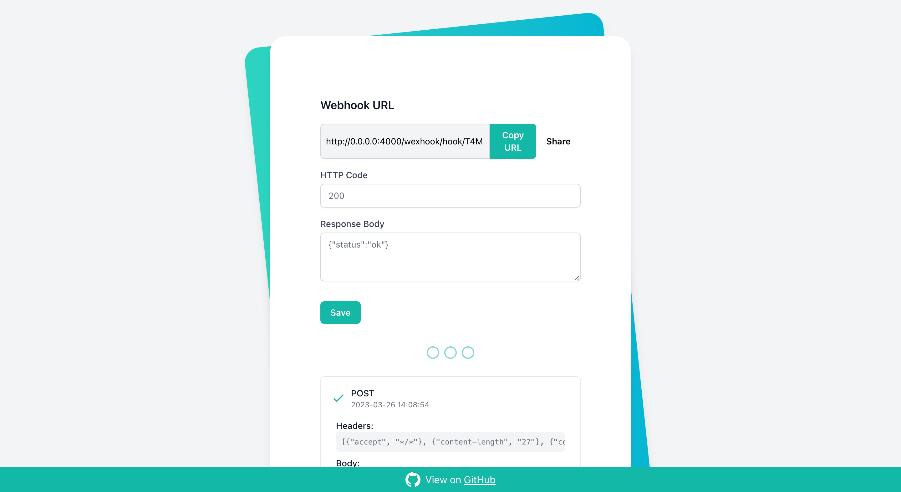

## Wexhook

Wexhook is a web server written in Elixir with LiveView, which allows you to simulate requests to an external service that expects to receive webhooks. With Wexhook, you can test your webhook integrations without having to send real requests to an external service. In addition, Wexhook provides a web interface for viewing and inspecting incoming webhook requests.




### Installation

To install Wexhook, first ensure that you have Elixir and Mix installed on your system. Then, clone this repository and run the following command to download the dependencies:

```shell
mix setup
```


### Running the Server

To start the Wexhook server, run the following command:

```shell
mix phx.server
```

This will start the server on http://0.0.0.0:4000/wexhook. You can access the web interface by visiting this URL in your web browser.


### Usage

Wexhook provides an endpoint for receiving webhook requests at `/wexhook/hook/:id`. You can use this endpoint to simulate webhook requests from an external service. When a webhook request is received, it will be stored in memory and displayed in the web interface for inspection.


### Limitations

There are a couple of limitations to be aware of when using Wexhook:

- Wexhook requests are stored in memory and will be lost if the server is restarted.
- Wexhook requests are stored in the LiveView state without temporary assigns, which can have an impact on memory usage.
- If you want to deploy Wexhook under a proxy like NGINX and expose the app under a custom path like `https://domain.com/app_1`, this won't be possible. The app is exposed in both `/` and `/wexhook` paths, so you can route to those paths to make Wexhook accessible.


### Technologies Used

Wexhook uses the following technologies:

- Elixir
- LiveView
- GenServers
- DynamicSupervisors
- Phoenix.PubSub

